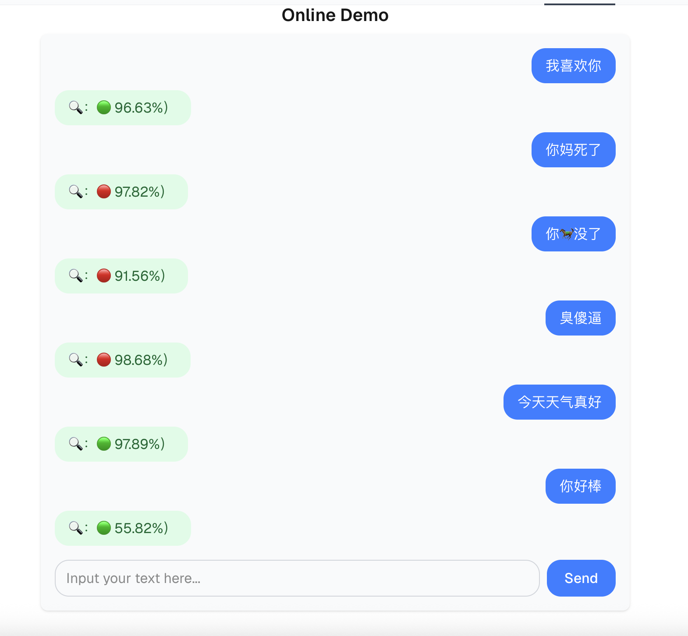
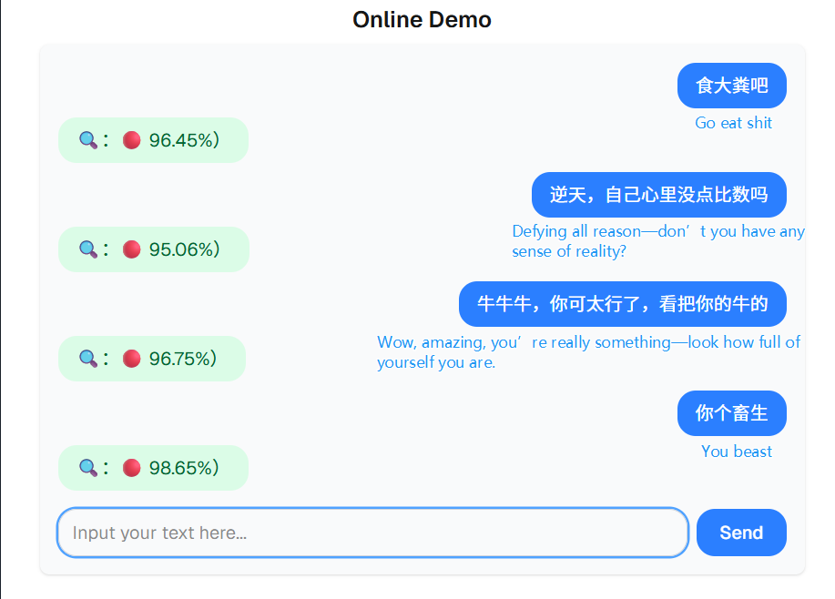

# LiteDetective

A lightweight Chinese malicious comment detection pipeline.

轻量级中文有害评论检测工具。

---

## Features / 功能简介
- Model training and evaluation for toxic comment detection
- Data processing and policy generation
- Console entry points for quick data and policy generation

- 有害评论检测模型训练与评测
- 数据处理与策略生成
- 命令行入口，便捷生成策略和训练数据

---

## Quick Start / 快速开始

### 1. Install dependencies / 安装依赖
```bash
pip install -r requirements.txt
```

### 2. Data Preparation / 数据准备
- Place your training and test data in the `data/` directory. See `data/` for format examples.
- 将训练和测试数据放入 `data/` 目录，格式可参考已有文件。

### 3. Train the model / 训练模型
```bash
python train.py
```

### 4. Test the model / 测试模型
```bash
python test.py
```

---

## Console Entrypoints / 命令行入口

After installation (or in project root):
安装后（或在项目根目录下）：

- Generate policy file / 生成策略文件：
```bash
build-policy --path data/raw --policy_file data/policy.jsonl
```
- Generate training data / 生成训练数据：
```bash
build-train-data --policy_file data/policy.jsonl --output_file data/training_data.jsonl
```

---

## Installation (with setup.py) / 安装（使用 setup.py）

You can install LiteDetective as a Python package, which will also enable the command line tools:

你可以通过 setup.py 安装本项目为 Python 包，并自动获得命令行工具：

```bash
pip install -e .
```

After installation, you can use the following commands anywhere:
安装后，可在任意位置使用以下命令：

- `build-policy`  ——  Generate policy file / 生成策略文件
- `build-train-data`  ——  Generate training data / 生成训练数据

---

## Project Structure / 项目结构
- `train.py`, `test.py`: Model training/testing
- `libs/`: Data processing, policy, LLM SDK, etc.
- `models/`: Model definitions
- `data/`: Datasets and generated files

- `train.py`, `test.py`：模型训练与测试
- `libs/`：数据处理、策略、LLM SDK 等
- `models/`：模型结构
- `data/`：数据集与生成文件

---

## License / 许可证
MIT License

---

## 使用 predict 函数进行推理 / How to use the predict function

### 1. 下载模型权重 (download the model weight file)
请从 [HuggingFace: Albert-CAC/lite_DETECTIVE](https://huggingface.co/Albert-CAC/lite_DETECTIVE/tree/main) 下载 `lited_best.pth` 文件，放到本地目录（如 `./hf_ckpt/`）。

### 2. 加载模型与权重 (load the model)
```python
import torch
from models.classifier import ToxicTextClassifier

model = ToxicTextClassifier()
state_dict = torch.load('hf_ckpt/lited_best.pth', map_location='cpu')
model.load_state_dict(state_dict)
model.eval()
```

### 3. 使用 predict 进行推理 (how to inference)
#### 单条文本 (without context)
```python
result = model.predict('你真讨厌', device='cpu')
print(result)
```
#### 批量文本 (batch without context)
```python
texts = ['你真讨厌', '你好棒']
results = model.predict(texts, device='cpu')
print(results)
```
#### 带上下文的批量文本 (batch with context)
```python
texts_with_context = [['你真讨厌', '你为什么这样说'], ['你好棒', '谢谢你的夸奖']]
results = model.predict(texts_with_context, device='cpu')
print(results)
```

### 4. 输出格式 (Output format)
每个结果为字典，包含：
- `text`: 输入文本
- `prediction`: 预测类别（0=正常，1=有害）
- `probabilities`: 每个类别的概率

For more detailed information and data visualization, please refer to our paper (see assets/paper.pdf).
如需参考更详细的介绍以及更多数据可视化，请参阅我们的论文（见 assets/paper.pdf）。

---

## 在线体验 / Online Demo

你可以在 HuggingFace Spaces 官方网站上在线体验本项目的推理效果：
[https://huggingface.co/spaces/Albert-CAC/lite_DETECTIVE](https://huggingface.co/spaces/Albert-CAC/lite_DETECTIVE)

You can try the official online demo here:
[https://huggingface.co/spaces/Albert-CAC/lite_DETECTIVE](https://huggingface.co/spaces/Albert-CAC/lite_DETECTIVE)

<div>
  
<p>1. **我喜欢你 - 96.63% (Positive)**<br>
   - Translation: I like you - 96.63% (Positive)<br>
   - Correctly identified as expressing positive sentiment.</p>

<p>2. **你妈死了 - 97.82% (Negative)**<br>
   - Translation: Your mother is dead - 97.82% (Negative)<br>
   - Correctly identified as expressing negative sentiment.</p>

<p>3. **你🐴没了 - 91.56% (Negative)**<br>
   - Translation: Your 🐴 is gone - 91.56% (Negative)<br>
   - Correctly identified as expressing negative sentiment. This might be unfamiliar to non-Chinese speakers, but it's a way of indirectly expressing a harsh sentiment.</p>

<p>4. **臭傻逼 - 98.68% (Negative)**<br>
   - Translation: You idiot - 98.68% (Negative)<br>
   - Correctly identified as expressing negative sentiment.</p>

<p>5. **今天天气真好 - 97.89% (Positive)**<br>
   - Translation: The weather is great today - 97.89% (Positive)<br>
   - Correctly identified as expressing positive sentiment.</p>

<p>6. **你好棒 - 55.82% (Positive)**<br>
   - Translation: You're great - 55.82% (Positive)<br>
   - Correctly identified as expressing positive sentiment, although the confidence level is relatively low.</p>

</div>

